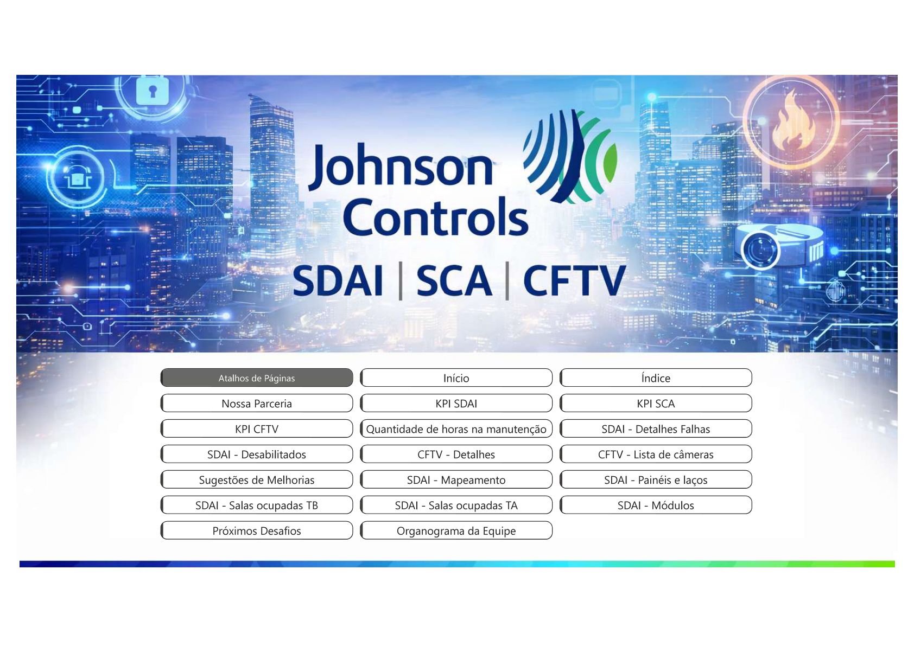
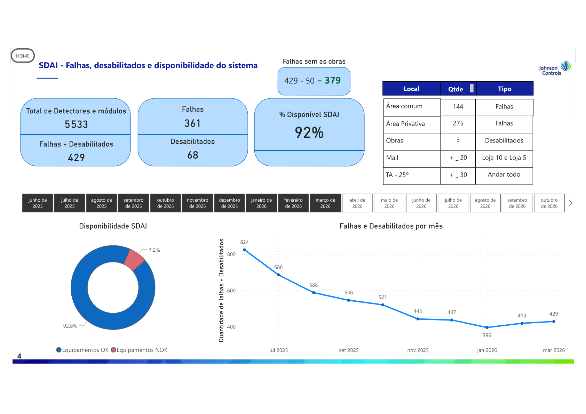
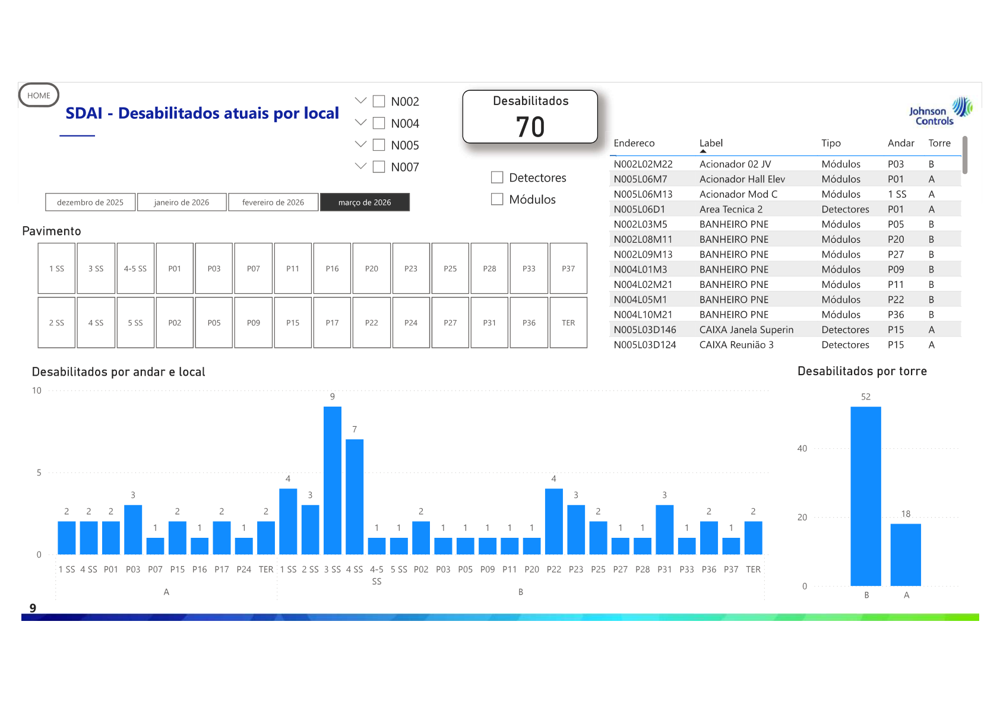
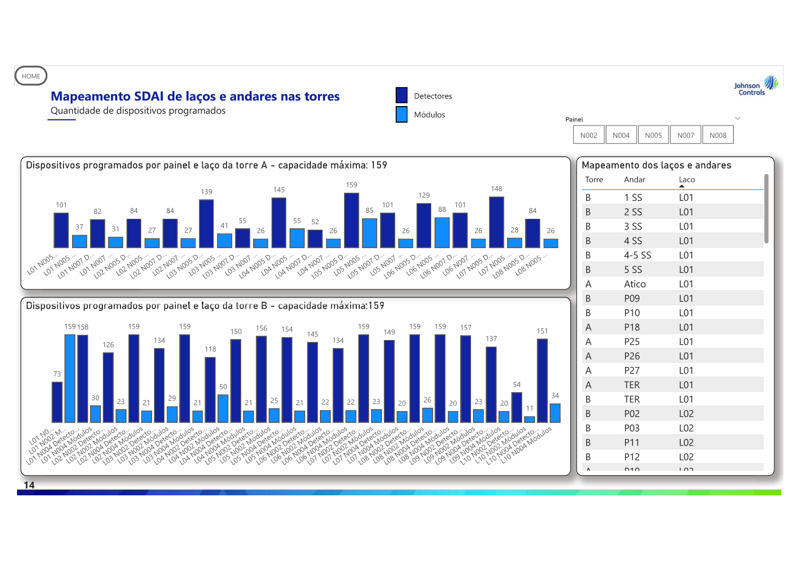

# Industrial Operations Analytics Dashboard

## Overview

This repository presents a managerial analytics report focused on operational performance, KPI monitoring, maintenance analysis and technical performance indicators.

The project was designed to simulate a corporate decision-support environment, where dashboards and structured reports are used to monitor operational efficiency, identify maintenance trends and support data-driven decisions.

> **Note:** The published version uses anonymized visuals and synthetic sample data to avoid exposing confidential operational information.

## Business Context

Operational and maintenance teams often need a clear view of performance indicators, pending issues, recurring failures and system availability. This project organizes these elements into a structured managerial report, enabling faster analysis and improved visibility for technical and leadership teams.

## Project Goals

- Monitor operational KPIs in a structured and visual way
- Support decision-making with analytical dashboards
- Track maintenance activities and open issues
- Analyze system availability and technical performance
- Present operational data in a professional managerial format

## Main Features

- Executive-style managerial report
- KPI tracking and performance monitoring
- Maintenance and failure analysis
- Operational visibility by system and area
- Dashboard-based data storytelling
- Structured report navigation and visual organization

## Tools and Skills Applied

- Power BI
- Microsoft Excel
- Data Analysis
- KPI Management
- Dashboard Design
- Operational Reporting
- Data Visualization
- Business Intelligence fundamentals

## Repository Structure

```text
industrial-operations-analytics/
│
├── README.md
├── .gitignore
│
├── dashboard/
│   └── relatorio-gerencial-mar-2026.pdf
│
├── images/
│   ├── cover.png
│   ├── overview.png
│   ├── kpi-analysis.png
│   ├── maintenance-analysis.png
│   ├── performance-dashboard.png
│   └── final-summary.png
│
└── data/
    └── sample-data.csv
```

## Dashboard Preview

### Cover



### KPI Overview


### KPI Analysis



### Maintenance Analysis



### Performance Dashboard



## Key Insights Demonstrated

This project demonstrates the ability to:

- Transform operational data into management-level information
- Build dashboards with focus on business and technical decision-making
- Organize indicators for performance monitoring
- Communicate analytical findings through visual reporting
- Structure a professional portfolio project based on realistic corporate scenarios

## Sample Data

The file `data/sample-data.csv` contains synthetic example data created only to demonstrate the expected dataset structure. It does not represent real operational data.

## Portfolio Relevance

This project is aligned with roles related to:

- Data Analytics
- Business Intelligence
- Operations Analytics
- Technical Performance Monitoring
- Entry-level Data Engineering / Analytics Engineering
- Decision Support and Reporting

## Professional Summary

Development of a managerial operational report using Power BI concepts to monitor KPIs, analyze maintenance indicators and support data-driven decision-making in a technical operations context.

## Author

Roberto De Carvalho

GitHub: [rcarvalhoo](https://github.com/rcarvalhoo)
